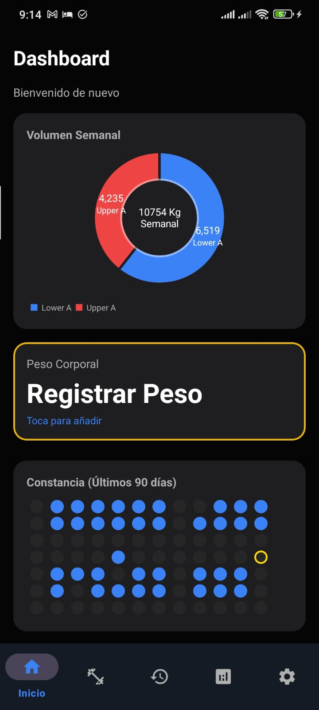
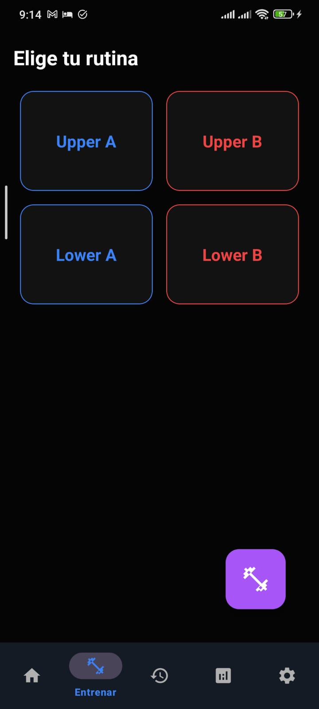
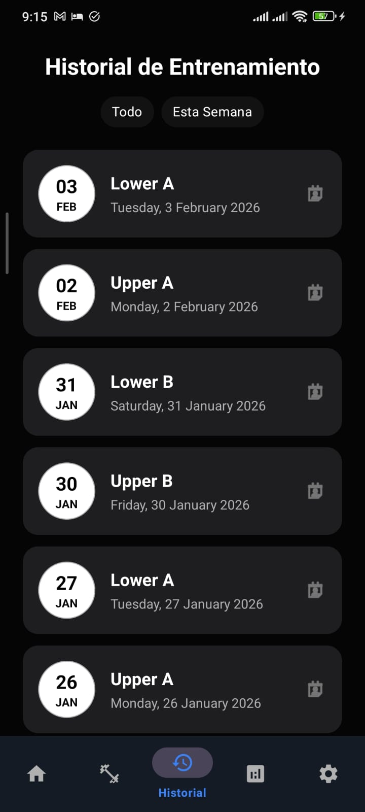
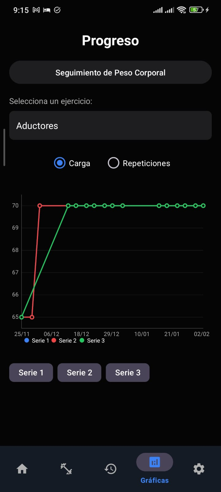
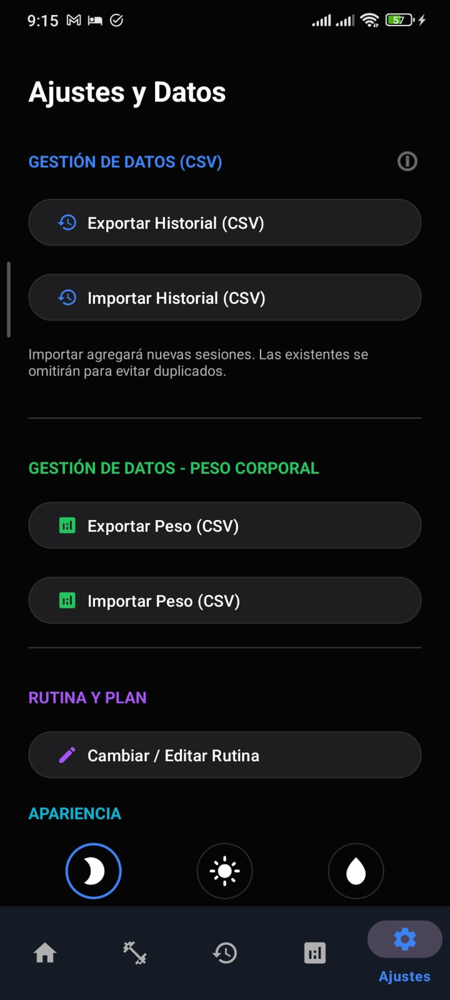

# Spotter 🏋️‍♂️

> **Tu compañero definitivo de entrenamiento inteligente.**


**Spotter** es una aplicación de Android moderna, limpia y potente diseñada para llevar el seguimiento de tus entrenamientos de gimnasio al siguiente nivel. Olvídate de las notas en papel; Spotter te permite gestionar rutinas, registrar series, visualizar tu progreso a largo plazo y mantener la constancia, todo con una interfaz intuitiva y adaptable a tus preferencias visuales.

## ✨ Características Principales

### 📅 Gestión de Rutinas Flexibles
*   **Asistente de Configuración Inicial**: Configura tu plan ideal desde el primer momento.
*   **Splits Clásicos Integrados**: Elige entre plantillas probadas como:
    *   Push / Pull / Legs (PPL)
    *   Upper / Lower
    *   Arnold Split
    *   Full Body
*   **Rutinas Personalizadas**: Crea tus propios splits desde cero o mezcla estilos.
*   **Entrenamiento Libre**: Inicia una sesión rápida sin una rutina predefinida.

### 📝 Tracking de Entrenamiento (Workout Logger)
*   Registro detallado de **Peso (kg/lbs)** y **Repeticiones**.
*    Soporte para diferentes unidades de medida (Placas, Kg, Lbs).
*   **Cronómetro de descanso** integrado.
*   Historial de sesiones anteriores visible durante el entrenamiento para aplicar sobrecarga progresiva.

### 📊 Estadísticas y Análisis
*   **Heatmap de Constancia**: Visualiza tus días de entrenamiento en un calendario térmico (con indicador del día actual).
*   **Gráficos de Progreso**: Analiza tu evolución en fuerza (1RM estimado, carga) o volumen por ejercicio a lo largo del tiempo.
*   **Filtros Interactivos**: Selecciona qué series visualizar en las gráficas para un análisis limpio.

### ⚖️ Seguimiento de Peso Corporal
*   Módulo dedicado para registrar tu peso corporal.
*   Visualización gráfica de tendencias (subida/bajada/mantenimiento).
*   Historial detallado con estilo de tarjetas y opción de eliminación rápida.

### 🎨 Personalización y Apariencia
*   **Temas Múltiples**:
    *   🌑 Modo Oscuro (Predeterminado)
    *   ☀️ Modo Claro
    *   ⬛ Modo Super AMOLED (Negro puro para ahorro de batería)
*   Interfaz optimizada para respetar los espacios del sistema (Notificaciones, Cámaras/Notch).

### 💾 Datos y Exportación
*   Base de datos local segura (**Room Database**).
*   **Importación/Exportación CSV**: Respalda tus datos o expórtalos para analizarlos en Excel/Google Sheets.

## 🛠️ Tecnologías y Arquitectura

El proyecto sigue una arquitectura sólida basada en las mejores prácticas de Android:

*   **Arquitectura**: MVVM (Model-View-ViewModel) para separar la lógica de negocio de la UI.
*   **Lenguaje**: Java.
*   **Persistencia de Datos**: Room (SQLite Abstraction Layer).
*   **Concurrencia**: Ejecutores asíncronos (`ExecutorService`) y `LiveData` para operaciones reactivas de UI.
*   **Navegación**: Android Navigation Component (Single Activity Architecture).
*   **Gráficos**: MPAndroidChart para visualizaciones de datos complejas.
*   **UI Components**: Material Design 3, RecyclerViews optimizados, ConstraintLayouts.

## 📱 Capturas de Pantalla

|  |  |  |  |
|:---:|:---:|:---:|:---:|
| **Inicio / Dashboard** | **Rutina / Entrenar** | **Historial** | **Progreso** |

|  |
|:---:|
| **Ajustes** |

## 🚀 Instalación y Configuración

Para ejecutar este proyecto localmente:

1.  **Clonar el repositorio**:
    ```bash
    git clone https://github.com/Jose-Garcia02/Spotter-Android.git
    ```
2.  **Abrir en Android Studio**:
    *   Abre Android Studio (Ladybug o superior recomendado).
    *   Selecciona `File > Open` y navega a la carpeta clonada.
3.  **Sincronizar Gradle**:
    *   Espera a que Android Studio descargue las dependencias y sincronice el proyecto.
4.  **Ejecutar**:
    *   Conecta un dispositivo Android (con modo depuración activado) o usa un emulador.
    *   Presiona el botón `Run` (▶️).

**Requisitos**:
*   Android SDK 31+ (Target).
*   JDK 11 o superior.

## 🤝 Contribuciones

¡Las contribuciones son bienvenidas! Si tienes ideas para mejorar Spotter:

1.  Haz un Fork del repositorio.
2.  Crea una rama para tu feature (`git checkout -b feature/NuevaCaracteristica`).
3.  Haz Commit de tus cambios (`git commit -m 'Agrega nueva característica'`).
4.  Haz Push a la rama (`git push origin feature/NuevaCaracteristica`).
5.  Abre un Pull Request.

## 📄 Licencia

Este proyecto es de uso personal y educativo.

---
Desarrollado con 💪 por [José García].

